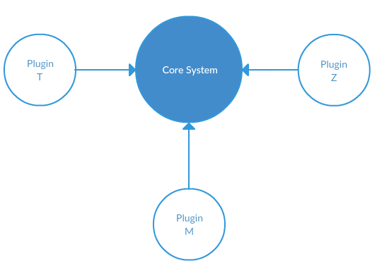

# Open - Closed Principle

#### Technical Explanation
> A satisfactory modular decomposition technique must satisfy one more requirement: 
> 
> It should yield modules that are both **open** and **closed**.
> 
> * A module will be said to be **open** if it is available for extension. For example, it should be possible to add fields to the data structures it contains, or new elements to the set of functions it performs.
> * A module will be said to be **closed** if is available for use by other modules. This assumes that the module has been given a well-defined, stable description (the interface in the sense of information hiding). In the case of a programming language module, a **closed** module is one that may be compiled and stored in a library, for others to use. In the case of a design or specification module, closing a module simply means having it approved by management, adding it to the project's official repository of accepted software items (often called the project baseline), and publishing its interface for the benefit of other module designers.

## What does this mean?

Imagine a system that is architected so that it could be infinitely extendable by new code without having the modify a single line of code of the core system. Every module could have its behavior extended, or completely overridden. New features could be added to the system without modifying the system.

Seem impossible?

Consider the tools that you use on a day-to-day basis: modern code editors.

Ever installed a plugin that provides the ability to do something in the editor that the base installation couldn't? Well, you just witnessed a very powerful implementation of the Open-Closed Principle (OCP). The base program is very rarely changed, and yet plugin developers can quickly provide extensions of the core system to fill the needs of different developers.

What's amazing about this kind of architecture is that the plugins have the ability to know about much of the architecture of the core system, and yet the core system has zero knowledge of the plugins.



Let's take a look at a much simpler case study of the Open-Closed Principle. The code below involves two modules that represent a bank account, and a bank teller that is the interface between the account and a customer.

## Basic Bank & Teller System

```js
  // Example JavaScript code here
```


## It's Closed

Now we have a module that is closed for modification, and can be used by any other program or library. It has a clear interface for building a command-line menu system, and is infinitely flexible because it prescribes no contraints on the actual functionality of a menu system. It simply displays prompts, and then invokes the appropriate action based on what the user selects.

## It's Open

It's also open, because we can add as many elements (menu items) as we want to it's internal collection, and it will still function without any issues.

